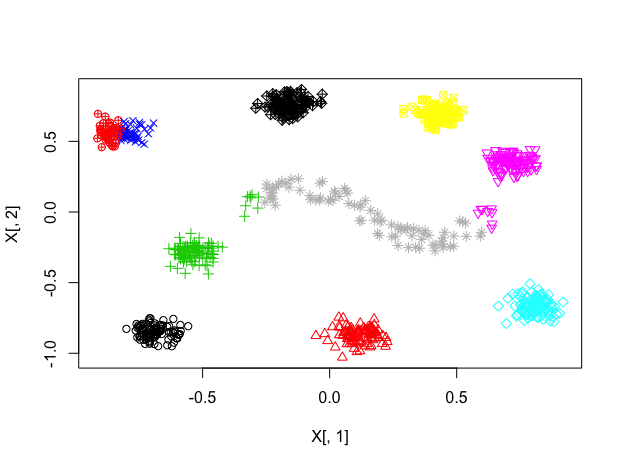
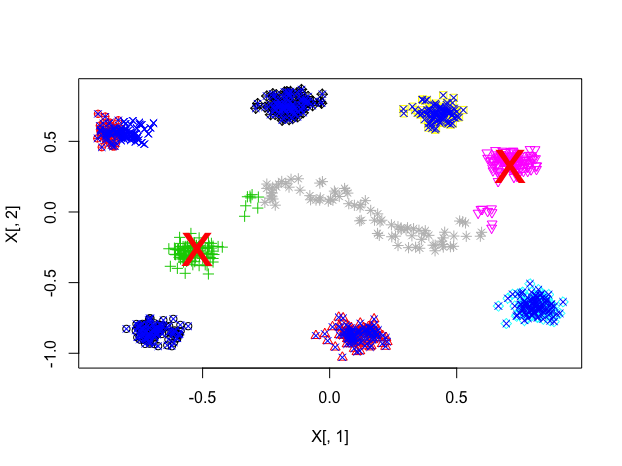
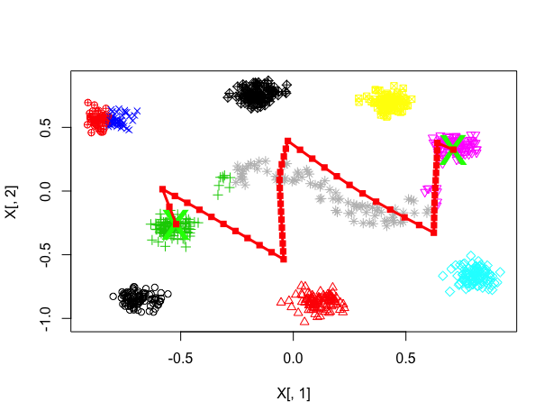
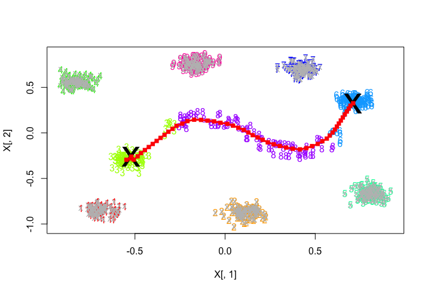
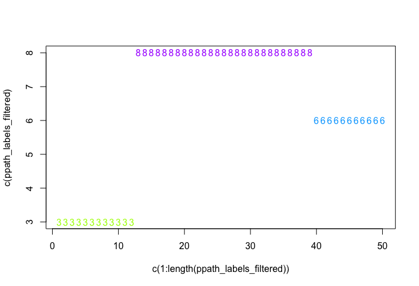
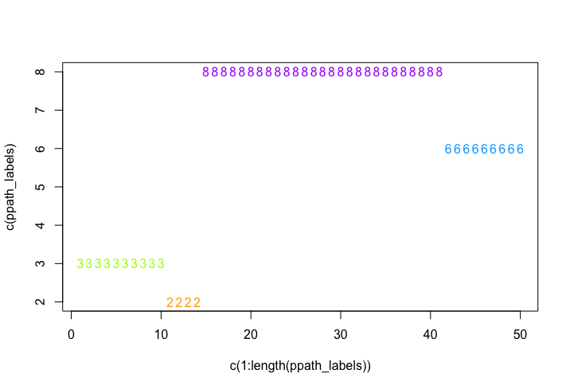
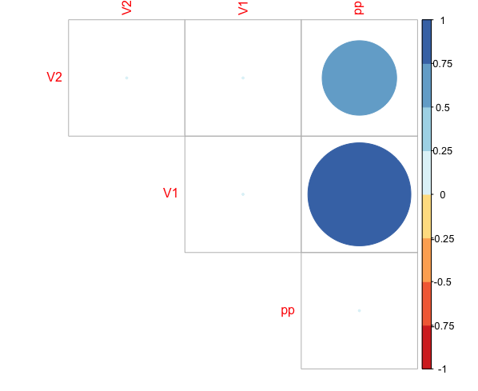

The spathial package contains function to create a path able to navigate a n-dimensional space. __ADD__

# Quick start
In this section we show the most basic steps which allows to compute the principal path. We begin with a simple example in 2-dimensions just to become familiar with the functions inside Spathial. 

Let's start installing spathial to ensure that all the needed spackages are installed.

```r
install.packages("spathial")
```

## Step 1: load data
To compute the principal path we assume that you have an input matrix ```X```. Each column of the matrix ```X``` is a feature and each row has a univocal name. We also assume that you have an input vector ```X_labels``` which contains for each row of ```X``` the corresponding label. For the sake of simplicity, we create a simple .csv file with 900 samples and 3 columns (2 + labels). The following code chunck shows how to load the .csv and how to format the data.

```r
#load the dataset
myfile<-system.file("extdata", "2D_constellation.csv", package = "spathial")
data<-read.csv(myfile,as.is=TRUE,header=TRUE)

#matrix X with 4 columns (4 dimensions) and univocal rownames
X <- data[,2:(ncol(data)-1)]
rownames(X)<-paste0("sam",rownames(X))

#vector X_labels
X_labels <- data$Y
```

Computing the function ```head``` given ```X``` and ```X_labels``` as input you can obtain the following output:

```r
> head(X)
            V1        V2
sam1  0.440620 -0.206480
sam2 -0.305250  0.122770
sam3 -0.234850  0.097566
sam4  0.205200 -0.058423
sam5  0.022774  0.134450
sam6 -0.223260  0.092053

> head(X_labels)
[1] 8 3 8 8 8 8
```

To following code chunk shows how to plot the datapoints colored according to ```X_labels```:

```r
#Plot the results
colors <- rainbow(length(table(X_labels)))
colors_labels <- sapply(X_labels, function(x){colors[x]})
plot(X[,1],X[,2], col=colors_labels,pch=as.character(X_labels))
```

The following picture shows the graphical representation of the datapoints:


## Step 2: select the boundaries
The fist step to compute the principal path consists in selecting the starting and the ending points. The package spathial gives you the function ```spathialBoundaryIds``` which takes as input the matrix ```X```, the corresponding labels ```X_labels``` and the parameters ```mode```, ```from``` and ```to```.

The parameter ```mode``` has to assume one the following values:

* __1__ _(default)_: the user can randomly choose the starting and the ending points directly from the 2D representations of the data points. In this case the values of the parameters ```from``` and ```to``` are not considered.
* __2__: the starting point is the centroid of all the data points labelled as the parameter ```from```, while the ending point is the centroid of all the data points labelled as the parameter ```to```.
* __3__: the starting point is the data point with the univocal rowname equal to the parameter ```from``` while the ending point is the data point with the univocal rowname equal to the parameter ```to```.

The output of the function ```spathialBoundaryIds``` is a list with the following content:

* __X__: the initial input matrix ```X``` plus the starting and the ending points;   
* __X_labels__: the initial vector ```X_labels``` inclusive of the labels of the starting and the ending points; 
* __boundary_ids__: the rowname of the starting and the ending points.

__N.B.__ The matrix ```X``` and the vector ```X_labels``` change only when ```mode=2``` (the resulting matrix and vector have two additional elements, corresponding to the centroids).

The following code chuncks show how to use the function ```spathialBoundaryIds```, with different values of the parameter ```mode```, and how to extract the output:

```r
#mode=1
boundary_init <- spathial::spathialBoundaryIds(X, X_labels, mode=1)
```

```r
#mode=2
boundary_init <- spathial::spathialBoundaryIds(X, X_labels, mode=2, from=3, to=6)
```

```r
#mode=3
boundary_init <- spathial::spathialBoundaryIds(X, X_labels, mode=3, from="sam123", to="sam456")
```

```r
#take the output from the variable boundary_init
boundary_ids <- boundary_init$boundary_ids
X <- boundary_init$X
X_labels <- boundary_init$X_labels
```

```r
#Plot the results
boundaries <- X[which(rownames(X) == boundary_ids[1] | rownames(X) == boundary_ids[2]),]
plot(X[,1],X[,2], col=colors_labels, pch=as.character(X_labels))
points(boundaries[,1],boundaries[,2], pch="x",col="black",cex=4)
```

The following picture shows the boundaries when ```mode=2```, ```from=3``` and ```to=6```:


## Step 3: prefiltering (optional)
The principal path is an algorithm intrinsically global. If you are searching for a path which does not involve the whole dataset, you can perform the function ```spathialPrefiltering```  before the principal path algorithm is applied, otherwise this filtering procedure is not due.

The function ```spathialPrefiltering``` takes as input the matrix ```X```, the corresponding labels ```X_labels``` and the boundaries ```boundary_ids``` which are the result of the function ```spathialBoundaryIds```.

The output of the function ```spathialPrefiltering``` is a list with the following content:

* __mask__: the indexes of the samples to preserve;   
* __boundary_ids_filtered__: the rowname of the starting and the ending points.

The following code chunck shows how to use the function ```spathialPrefiltering``` and how to extract the output:

```r
# Prefilter data
filter_res <- spathial::spathialPrefiltering(X, X_labels, boundary_ids)
mask <- filter_res$mask
boundary_ids <- filter_res$boundary_ids

#Plot the results
boundaries <- X[which(rownames(X) == boundary_ids[1] | rownames(X) == boundary_ids[2]),]
X_garbage <- X[!mask,]

plot(X[,1],X[,2], col=colors_labels, pch=as.character(X_labels))
points(boundaries[,1],boundaries[,2], pch="x",col="black",cex=4)
points(X_garbage[,1],X_garbage[,2], col="gray", pch=4)
```

The following picture shows the result of the plot:


## Step 4: principal path
The function ```spathialWay``` computes the principal path algorithm and gives as output the principal path points. It takes as input the matrix ```X```, the labels ```X_labels```, the boundaries ```boundary_ids``` and the parameters ```NC``` and ```neighbors```. 
```NC``` is the desired number of waypoints of the resulting principal path. For example, given ```NC=10``` the resulting principal path will be composed of 10 waypoints plus the starting and the ending points. 

For the sake of simplicity, in this section we discuss only the simple version with ```neighbors=1```, which is the default value. We discuss more complex examples in the next section.

The output of the function ```spathialWay``` is a list with the following content:

* __ppath__: the waypoints of the principal path;   
* __perturbed_paths__: the waypoints of all the perturbed paths.

With ```neighbors=1``` the value of the output ```perturbed_path``` will be always equal to ```NULL```.

The following code chuncks show how to use the function ```spathialWay```, with or without prefiltering, and how to extract the output:

```r
# Compute principal path without prefiltering
NC <- 50
spathial_res <- spathial::spathialWay(X, X_labels, boundary_ids, NC, neighbors = 1)
```

```r
# Compute principal path after prefiltering
X_filtered <- X[mask,]
X_labels_filtered <- X_labels[mask]
NC <- 50
spathial_res <- spathial::spathialWay(X_filtered, X_labels_filtered, boundary_ids, NC, neighbors = 1)
```

The next subsection shows hot to use the result ```spathial_res```.

## Step 5: understanding the results
The package Spathial includes three different functions to understand the output of the principal path algorithm: ```spathialPlot```, ```spathialLables``` and ```spathialStatistics```. The following subsections describe what they do and how to use each of them.

### Plot principal path
The function ```spathialPlot``` plots the principal path together with all the data points (filtered and not) and the boundaries. The function takes as input the matrix ```X``` (the initial version), the vector ```X_labels```, the boundaries ```boundary_ids```, the output of the principal path algorithm ```spathial_res```, the parameter ```perplexity value``` (default 30) and the parameter ```mask``` which is one of the result of the prefiltering and it is ```NULL``` when the prefiltering is not computed.
When the input matrix ```X``` has more than 2 columns, the function reduce the dimension of the space from N (>2) to 2 using the t-SNE algorithm.

The following code chuncks show hot to use the function ```spathialPlot``` with the principal path generated during the previous step (with and without prefiltering):

```r
#Plot principal path with prefiltering - mask not NULL
spathialPlot(X, X_labels, boundary_ids, spathial_res, perplexity_value=30, mask)

#Plot principal path without prefiltering - mask NULL
spathialPlot(X, X_labels, boundary_ids, spathial_res, perplexity_value=30)
```

The following pictures show the output of the function ```spathialPlot``` for both the examples:




### Compute lables with Knn
The function ```spathialLables``` assignes to each waypoints of the principal path a lables considering the labels of the nearest point in the data space. This type of analysis can be useful when you want to verify if the path moves respecting a specific evolution. The function takes as input the matrix ```X``` (which is composed only by the preserved samples if you compute the prefiltering), the vector ```X_labels``` and the output of the principal path algorithm ```spathial_res```. The output are the labels for each waypoints of the principal path.

The following code chuncks show how to use the function ```spathialLabels``` and how to plot the result:

```r
#Matrix X not filtered
ppath_labels <- spathialLabels(X, X_labels, spathial_res)
#Plot the results
ppath_labels <- as.vector(ppath_labels)
colors_labels_ppath <- sapply(ppath_labels, function(y){colors[as.integer(y)]})
plot(c(1:length(ppath_labels)), c(ppath_labels), col=colors_labels_ppath, pch=as.character(ppath_labels))
```

```r
#Matrix X filtered
#Labels for each waypoint with knn
ppath_labels <- spathialLabels(X_filtered, X_labels_filtered, spathial_res)

#Plot the results
ppath_labels<- as.vector(ppath_labels)
colors_labels_ppath <- sapply(ppath_labels, function(y){colors[as.integer(y)]})
plot(c(1:length(ppath_labels)), c(ppath_labels), col=colors_labels_ppath, pch=as.character(ppath_labels))
```

The following pictures show the labels for each waypoint for both the previous examples:




### Compute the statistics
The function ```spathialStatistics``` returns some statistics related to result of the principal path algorithm ```spathial_res```.
In particular, here we want to focus on how much each feature (a coordinate of the N-dimensional space) is involved along the evolution of the principal path. 

For this reason, the output of the function ```spathialStatistics``` is a list with the following content:

* __correlations__;
* __fisher_correlations__; gives for each f
* __rank_scores__.

Given the simplified scenario where the parameter ```neighbors``` of the function ```spathialWay``` is always equal to ```1```, the output of the function ```spathialStatistics``` is simplified as follow:

* __correlations__: gives for each features the correlation value with the evolution of the principal path;
* __fisher_correlations__: NULL;
* __rank_scores__: NULL.

The following code chuncks show how to use the function ```spathialStatistics``` and how to plot the results:

```r
#Statistics about each feature of the path
statistics <- spathialStatistics(spathial_res)
```

```r
#Plot the results
corr_values <- as.numeric(unlist(statistics$correlations))
correlation_matrix <- matrix(data=0, nrow = (length(corr_values)+1), ncol = (length(corr_values)+1))
colnames(correlation_matrix) <- c(colnames(X), "pp")
rownames(correlation_matrix) <- c(colnames(X), "pp")
correlation_matrix[,ncol(correlation_matrix)] <- c(corr_values, 0)
correlation_matrix[nrow(correlation_matrix),] <- c(corr_values, 0)

library(corrplot)
library(RColorBrewer)
corrplot(correlation_matrix, type="upper", order="hclust",
         col=brewer.pal(n=8, name="RdYlBu"))
```

The following pictures show how much each feature is correlated with the evolution of the principal path (for both the principath paths with and without prefiltering):



__N.B.__: all the other blocks are intentionally blank, beacuse not interesting for our goal.


