```{r echo=FALSE}
knitr::opts_chunk$set(fig.width=7, fig.height=5) 
```

The _spathial_ package contains function to create a path able to navigate a n-dimensional space.

# Quick start
In this section we show the most basic steps to compute the _spathial_ implementation of the principal path [citation needed], through a simple 2-dimensional example.

Let's start installing spathial to ensure that all the needed spackages are installed.
```{r eval=FALSE}
install.packages("spathial")
```

And then we load the package:
```{r}
library("spathial")
```

## Step 1: load data
To compute the principal path we assume that you have an input matrix ```X```. Each column of the matrix ```X``` is a feature (e.g. a gene) and each row has a univocal name (e.g. a sample). We also assume that you have an input vector ```X_labels``` which contains for each row of ```X``` a description label (e.g. the sample category). Labels must be integer numbers ranging from 1 to the n-th category. For the sake of simplicity, we provide a simple .csv file with 900 samples and 3 columns (2 + labels). The following code chunck shows how to load the .csv and how to format the data.

```{r}
# Load the dataset with 900 samples
myfile<-system.file("extdata", "2D_constellation.csv", package = "spathial")
data<-read.csv(myfile,as.is=TRUE,header=TRUE,row.names=1)
head(data)
```

```{r}
# Vector X_labels
X_labels <- data$label

# Data Matrix X
X <- data[,1:(ncol(data)-1)]
```

This is how the The Data Matrix ```X``` should look like at this point
```{r}
head(X)
```

The sample labels Vector ```X_labels```, assigning categories to each sample,
according to the order in ```X``` rows
```{r}
head(X_labels)
```

The following code chunk shows how to plot the datapoints colored according to ```X_labels```:

```{r fig.cap="_Quick Start example dataset_"}
# Plot the results
colors<-rainbow(length(unique(X_labels)))
colors_labels<-sapply(X_labels,function(x){colors[x]})
plot(X[,1],X[,2],col=colors_labels,pch=as.character(X_labels),
     xlab=colnames(X)[1],ylab=colnames(X)[2])
```


<!-- The following picture shows the graphical representation of the datapoints: -->
<!-- 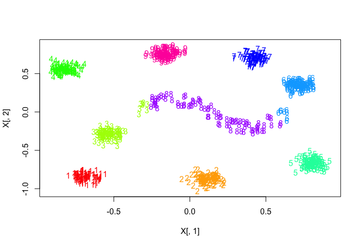{width=75%} -->


## Step 2: select the boundaries
The fist step to compute the principal path consists in selecting the starting and the ending points. The package spathial gives you the function ```spathialBoundaryIds``` which takes as input the matrix ```X```, the corresponding labels ```X_labels``` and the parameters ```mode```, ```from``` and ```to```.

The parameter ```mode``` has to assume one the following values:

* __1__ _(default)_: the user can choose the starting and the ending points directly from the 2D representations of the data points. In this case the values of the parameters ```from``` and ```to``` are not considered.
* __2__: the starting point is the centroid of all the data points labelled as the parameter ```from```, while the ending point is the centroid of all the data points labelled as the parameter ```to```.
* __3__: the starting point is the data point with the univocal rowname equal to the parameter ```from``` while the ending point is the data point with the univocal rowname equal to the parameter ```to```.

The output of the function ```spathialBoundaryIds``` is a list with the following content:

* __X__: the initial input matrix ```X``` plus the starting and the ending points;   
* __X_labels__: the initial vector ```X_labels``` inclusive of the labels of the starting and the ending points; 
* __boundary_ids__: the rowname of the starting and the ending points.

__N.B.__ The matrix ```X``` and the vector ```X_labels``` change only when ```mode=2``` (the resulting matrix and vector have two additional elements, corresponding to the centroids).

The following code chunks show how to use the function ```spathialBoundaryIds```, with different values of the parameter ```mode```, and how to extract the output:

``` {r eval=FALSE}
# mode=1 (User-selected)
boundary_init <- spathial::spathialBoundaryIds(X, X_labels, mode=1)
```
``` {r eval=FALSE}
# mode=3 (From named sample to another named sample)
boundary_init <- spathial::spathialBoundaryIds(X, X_labels, mode=3,
                                               from="sample123", to="sample456")
```
``` {r}
# mode=2 (From named label centroid to another label centroid)
boundary_init <- spathial::spathialBoundaryIds(X, X_labels, mode=2, from=3, to=6)
```

Once the boundaries are defined, and only in the case of ```mode=2```, the ```X``` and X_labels objects contain extra meta-samples (the boundaries) and need to be updated.
``` {r}
# Take the output from the variable boundary_init
boundary_ids<-boundary_init$boundary_ids
X<-boundary_init$X
X_labels<-boundary_init$X_labels
```

The following plots the boundaries when ```mode=2```, ```from=3``` and ```to=6```:
``` {r fig.cap="_Quick Start example - boundaries_"}
plot(X[,1],X[,2], col=colors_labels, pch=as.character(X_labels),
     xlab=colnames(X)[1],ylab=colnames(X)[2],main="Boundary points")
points(X[boundary_ids,],pch="x",col="black",cex=4)
```

<!-- 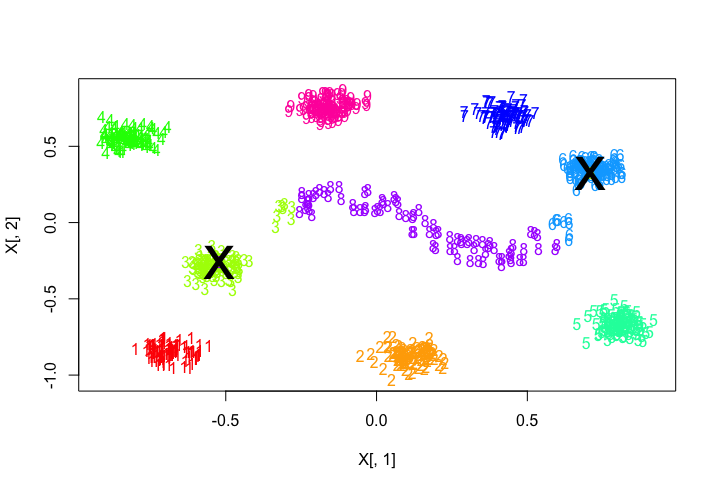{width=75%} -->

## Step 3: prefiltering (optional)
The principal path is an algorithm intrinsically global. If you are searching for a path which does not involve the whole dataset, you can perform the function ```spathialPrefiltering```  before the principal path algorithm is applied. If you want to run _spathial_ on the entire dataset, this filtering procedure is not due.

The function ```spathialPrefiltering``` takes as input the matrix ```X```, the corresponding labels ```X_labels``` and the boundaries ```boundary_ids``` which are the result of the function ```spathialBoundaryIds```.

The output of the function ```spathialPrefiltering``` is a list with the following content:

* __mask__: the indexes of the samples to preserve;   
* __boundary_ids_filtered__: the rowname of the starting and the ending points.

The following code chunck shows how to use the function ```spathialPrefiltering``` and how to extract the output. The function tags excluded samples and we store them in the ```X_garbage``` matrix. The ```mask``` vector contains the samples to be kept.

```{r}
# Prefilter data
filter_res <- spathial::spathialPrefiltering(X, X_labels, boundary_ids)
mask <- filter_res$mask
boundary_ids <- filter_res$boundary_ids

# Plot the results
boundaries <- X[which(rownames(X) == boundary_ids[1] | rownames(X) == boundary_ids[2]),]
X_garbage <- X[!mask,]
```

The following code shows the results of the prefiltering step, with excluded points greyed out:
```{r fig.cap="_Quick Start example - prefiltering_"}
par(mfrow=c(1,2))
plot(X[,1],X[,2], col="black",pch=20,main="Before Filtering",
     xlab=colnames(X)[1],ylab=colnames(X)[2])
points(X[boundary_ids,],pch="x",col="red3",cex=4)
plot(X[,1],X[,2], col="black",pch=20,main="After Filtering",
     xlab=colnames(X)[1],ylab=colnames(X)[2])
points(X[boundary_ids,],pch="x",col="red3",cex=4)
points(X_garbage[,1],X_garbage[,2], col="gray", pch=16)
```

<!-- 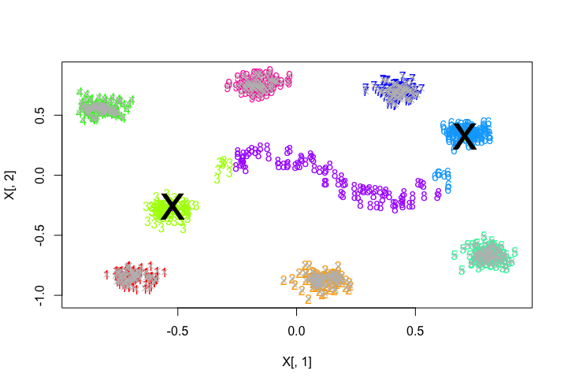{width=75%} -->

## Step 4: principal path
The function ```spathialWay``` computes the principal path algorithm and gives as output the principal path points. It takes as input the matrix ```X```, the labels ```X_labels```, the boundaries ```boundary_ids``` and the parameters ```NC``` and ```neighbors```. 
```NC``` is the desired number of waypoints of the resulting principal path. For example, given ```NC=10``` the resulting principal path will be composed of 10 waypoints plus the starting and the ending points. 

For the sake of simplicity, in this section we discuss only the simple version with ```neighbors=0```, which is the default value. We discuss more complex examples in the next section.

The output of the function ```spathialWay``` is a list with the following content:

* __ppath__: the waypoints of the principal path;   
* __perturbed_paths__: the waypoints of all the perturbed paths.

With ```neighbors=0``` the value of the output ```perturbed_path``` will be always equal to ```NULL```.

The following code chuncks show how to use the function ```spathialWay```, with or without prefiltering, and how to extract the output:

```{r results='hide'}
# Compute principal path without prefiltering
NC <- 50
spathial_res <- spathial::spathialWay(X, X_labels, boundary_ids, NC, neighbors = 0)
```

```{r results='hide'}
# Compute principal path after prefiltering
X_filtered <- X[mask,]
X_labels_filtered <- X_labels[mask]
NC <- 50
spathial_res <- spathial::spathialWay(X_filtered, X_labels_filtered, boundary_ids, NC, neighbors = 0)
```

The next subsection shows how to extract results from the ```spathial_res``` object.

## Step 5: understanding the results
The package _spathial_ includes three different functions to understand the output of the principal path algorithm: ```spathialPlot```, ```spathialLables``` and ```spathialStatistics```. The following subsections describe what they do and how to use each of them.

### Plot principal path
The function ```spathialPlot``` plots the principal path together with all the data points (filtered and not) and the boundaries. The function takes as input the matrix ```X``` (the initial version), the vector ```X_labels```, the boundaries ```boundary_ids```, the output of the principal path algorithm ```spathial_res```, the parameter ```perplexity value``` (default 30) and the parameter ```mask``` which is one of the result of the prefiltering and it is ```NULL``` when the prefiltering is not computed.
When the input matrix ```X``` has more than 2 columns, the function reduce the dimension of the space from N (>2) to 2 using the t-SNE algorithm.

The following code chuncks show hot to use the function ```spathialPlot``` with the principal path generated during the previous step (with and without prefiltering):

```{r fig.height=10, fig.cap='_Output of the spathialPlot() function. Filtered samples are marked in grey_'}
par(mfrow=c(2,1))
# Plot principal path with prefiltering - provide a mask
spathial::spathialPlot(X, X_labels, boundary_ids, spathial_res,
                       perplexity_value=30, mask=mask,
                       xlab=colnames(X)[1],ylab=colnames(X)[2],
                       main="Principal path with prefiltering"
)

# Plot principal path without prefiltering - mask NULL
spathial::spathialPlot(X, X_labels, boundary_ids, spathial_res,
                       perplexity_value=30,
                       xlab=colnames(X)[1],ylab=colnames(X)[2],
                       main="Principal path without prefiltering"
)
```
<!-- The following pictures show the output of the function ```spathialPlot``` for both the examples: -->
<!-- 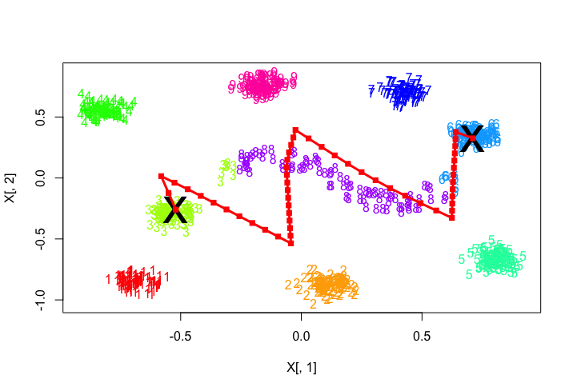{width=75%} -->
<!-- 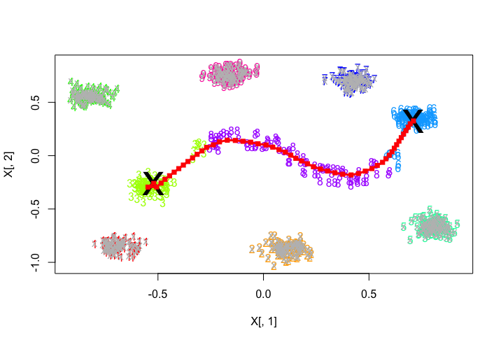{width=75%} -->

### Assess path progression __THE PARAGRAPH IS COMPLETELY UNCLEAR. WHY THIS IS USEFUL TO THE NEW USER? WHAT IS KNN? EXPLAIN BETTER__
The function ```spathialLabels``` assigns to each waypoints of the principal path a label considering the label of the nearest point in the data space. This type of analysis can be useful when you want to verify if the path moves respecting a specific evolution. The function takes as input the matrix ```X``` (which is composed only by the preserved samples if you compute the prefiltering), the vector ```X_labels``` and the output of the principal path algorithm ```spathial_res```. The output are the labels for each waypoint of the principal path.

The following code chuncks show how to use the function ```spathialLabels``` and how to plot the result:

```{r fig.cap='_Quick Start example - path labels across path steps_'}
### Matrix X not filtered
ppath_labels <- spathial::spathialLabels(X, X_labels, spathial_res)
# Plot the results
ppath_labels <- as.vector(ppath_labels)
colors_labels_ppath <- sapply(ppath_labels, function(y){colors[as.integer(y)]})
plot(c(1:length(ppath_labels)), c(ppath_labels), col=colors_labels_ppath,
     pch=as.character(ppath_labels), xlab="Path Step", ylab="Sample Label",
     main="Path progression"
)
```

<!-- The following pictures show the labels for each waypoint for both the previous examples: -->
<!-- 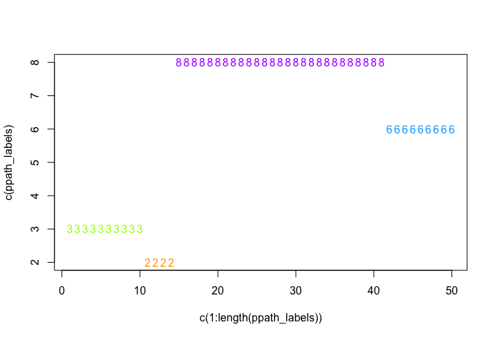{width=75%} -->
<!-- 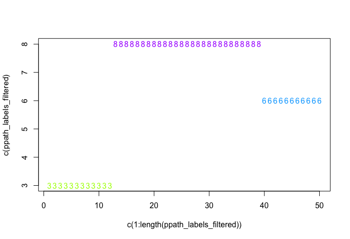{width=75%} -->

### Extract Features associated to the principal path
The function ```spathialStatistics``` returns statistics for each feature, based on their relation with th principal path calculated and stored in ```spathial_res```.
In particular, here we want to focus on how much each feature (a coordinate of the N-dimensional space) is involved along the evolution of the principal path. 

For this reason, the output of the function ```spathialStatistics``` is a list with the following content, associating the features with a specific score associating it with path progression.

* __correlations__: This vector contains the Pearson's correlation coefficients between each feature and the path.
In the case of multiple paths (see the _neighbor_ parameter, described later in this vignette), a simple arithmetic mean of the correlation coefficients is provided (**Which is simply a WRONG and not accepted mathematical operation and I don't know why you don't want to ackowledge it. This is a huge open flank for statisticians to reject the package and the paper https://www.researchgate.net/post/average_of_Pearson_correlation_coefficient_values https://stats.stackexchange.com/questions/8019/averaging-correlation-values**)
* __fisher_correlations__; This vector contains the Pearson's correlation coefficients between each feature and the path.
In the case of multiple paths (see the _neighbor_ parameter, described later in this vignette), a Fisher-integrated correlation coefficient is provided.
* __rank_scores__: This vector contains the ranks of associations between the n features and the path (1 being the most positively correlated, and n the most negatively correlated).
In the case of multiple paths (see the _neighbor_ parameter, described later in this vignette), a Fisher-integrated correlation coefficient is provided.

The following code chunks show how to use the function ```spathialStatistics``` and to extract the correlation-based association between features and the path.

```{r message="hide"}
# Calculate Association Statistics for each feature in the path
statistics <- spathial::spathialStatistics(spathial_res)

# Extract Pearson correlation coefficients between features and path
statistics$correlations
```

<!-- The following pictures show how much each feature is correlated with the evolution of the principal path (for both the principath paths with and without prefiltering): -->

<!-- 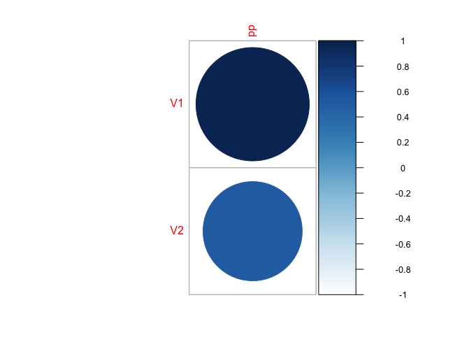{width=35%}  -->

<!-- 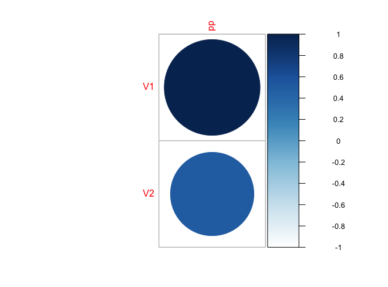{width=35%} -->


# A slightly more complex example
In this section we show another example with more than 2-dimensions. In this case our input matrix ```X``` is a reduced version of the TCGA Liver Cancer dataset which is composed only by the 100 features (genes) with the highest variance. The vector ```X_labels``` contains the information about the patiens. In particular, the label is 2 when the patiens is healthy, 1 otherwise.

In this case, the aim of the example is to navigate the space fram the centroid of the healthy patients to the centroid of the unhealthy patients in order to gradually morphing from one health state to the other.

The prefiltering won't be executed since we are searching for a global solution.

The following code chuncks show how to compute the principal path algorithm:

```r
#Load data
myfile<-system.file("extdata", "liver_tcga_example1.csv", package = "spathial")
data<-read.csv(myfile,as.is=TRUE,header=TRUE)
X <- data[,2:(dim(data)[2]-1)]
X_labels <- data[,dim(data)[2]]
rownames(X)<-data[,1]

# Choose the starting and the ending points
boundary_init <- spathial::spathialBoundaryIds(X, X_labels, mode=2, from=2, to=1)#from="TCGA-DD-A39W-11A-11R-A213-07", to="TCGA-G3-AAV2-01A-11R-A37K-07")
boundary_ids <- boundary_init$boundary_ids
X <- boundary_init$X
X_labels <- boundary_init$X_labels

# Compute spathial
NC <- 50
spathial_res <- spathial::spathialWay(X, X_labels, boundary_ids, NC, neighbors = 0)
```
What follow is the code to analize the results:

```r
#Labels for each waypoint with knn
ppath_labels <- spathial::spathialLabels(X, X_labels, spathial_res)

#Plot the path in 2D using Rtsne
spathial::spathialPlot(X, X_labels, boundary_ids, spathial_res, perplexity_value=30)

#Correlation along the path
spathial::statistics <- spathialStatistics(spathial_res)
```
The result of the ```spathialLabels``` function can be plotted with the following script:

```r
ppath_labels <- as.vector(ppath_labels)
colors <- rainbow(length(table(X_labels)))
colors_labels_ppath <- sapply(ppath_labels, function(y){colors[as.integer(y)]})
plot(c(1:length(ppath_labels)), c(ppath_labels), col=colors_labels_ppath, pch=as.character(ppath_labels))
```

The following pictures shows the labels of the principal path and the result of the function ```spathialPlot```:

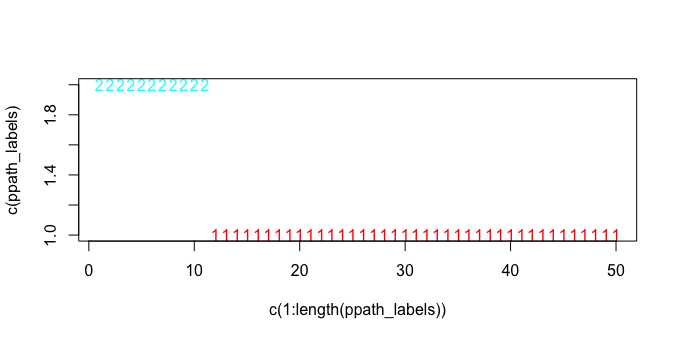{width=50%}

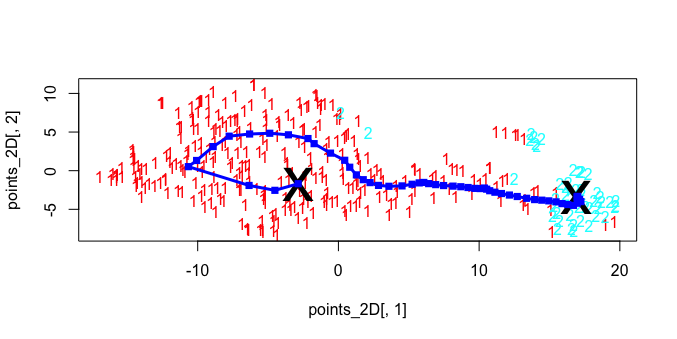{width=50%}

In this case, the statistics are particular interesting. 
In fact, they contains information about the correlation between each feature (genes) of the principal path and a vector from 1 to NC+2 (where NC is the number of waypoints) and help to find the genes particularly involved with the evolution from the healthy to the unhealthy state.

The following code chunck show how to plot the 20 features more involved in the evolution:

```r
corr_values <- as.numeric(unlist(statistics$correlations))
arg_sort <- rank(-abs(corr_values))
indexes <- which(arg_sort < 20)

sub_correlation_matrix <- matrix(data=0, nrow = (length(indexes)), ncol = 1)
colnames(sub_correlation_matrix) <- "pp"
rownames(sub_correlation_matrix) <- colnames(X[indexes])
sub_correlation_matrix[,ncol(sub_correlation_matrix)] <- corr_values[indexes]

library(corrplot)
library(RColorBrewer)
corrplot(sub_correlation_matrix, method="circle", is.corr=FALSE, cl.pos = "r", cl.ratio = 1, cl.lim = c(-1,1))

```

The following picture shows the corresponding output:

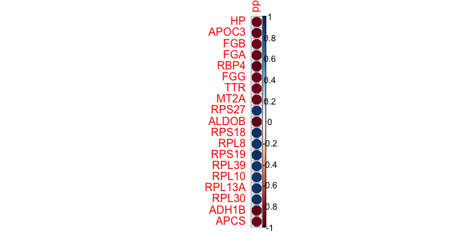{width=50%}

This picture identifies the genes that could be particolarly involved during the evolution from healthy to unhealthy. 

# How to work with high-dimensional data
When you want to work with high dimensional data, one of the problems that could occur is the overfitting. This means that the principal path algorithm could find a lot of different features all correlated with the evolution from the starting point to the ending one. 

If you are interested in finding a restricted group of features which are very correlated with the evolution, we suggest to use a more complex version of the function ```spathialWay```. It takes as input the parameter ```neighbour > 0``` and perform a refined version of the principal path algorithm.

The following picture graphically explain how this version of the function ```spathialWay``` works when ```neighbour = 2```:

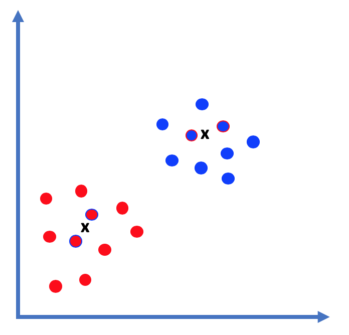{width=50%}

It selects the ```neighbour``` nearest data points to the starting and the ending points and computes the principal path algorithm for each combination. This refined procedure allows to compute ```neighbour*neighbour``` paths: one of them is the normal principal path and the others can be considered as perturbation of the first one.

The correlation can now be computed as mean of the correlations of each path. In this case, the statistics output is enriched with the ```fisher_correlations``` and the ```rank_scores``` parameters.

The following code chunck shows an example of the ```spathialWay``` function with ```neighbour = 1``` and the same dataset of the previous example:

```r
####Load input data
myfile<-system.file("extdata", "liver_tcga_example1.csv", package = "spathial")
data<-read.csv(myfile,as.is=TRUE,header=TRUE)
X <- data[,2:(ncol(data)-1)]
rownames(X)<-paste0("sam",rownames(X))
X_labels <- data$Y

#### Choose the starting and the ending points
boundary_init <- spathialBoundaryIds(X, X_labels, mode=2, from=2, to=1)
boundary_ids <- boundary_init$boundary_ids
X <- boundary_init$X
X_labels <- boundary_init$X_labels

# Compute spathial
NC <- 50
spathial_res <- spathialWay(X, X_labels, boundary_ids, NC, neighbors = 1)

#Plot the path in 2D using Rtsne
spathialPlot(X, X_labels, boundary_ids, spathial_res, perplexity_value=30)

# ####Correlation along the path
statistics <- spathialStatistics(spathial_res)

#Plot the results
corr_values <- as.numeric(unlist(statistics$correlations))
arg_sort <- rank(-abs(corr_values))
indexes <- which(arg_sort < 20)

sub_correlation_matrix <- matrix(data=0, nrow = (length(indexes)), ncol = 1)
colnames(sub_correlation_matrix) <- "pp"
rownames(sub_correlation_matrix) <- colnames(X[indexes])
sub_correlation_matrix[,ncol(sub_correlation_matrix)] <- corr_values[indexes]

library(corrplot)
library(RColorBrewer)
corrplot(sub_correlation_matrix, method="circle", is.corr=FALSE, cl.pos = "r", cl.ratio = 1, cl.lim = c(-1,1))
```

The following pictures show the output of the example:

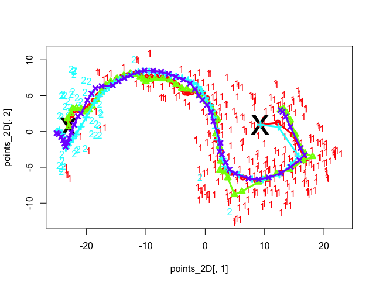{ width=50% }

__Warning__: the grater is the value of the parameter ```neighbour > 5```, the slower is the algorithm. Our recommendation is to use ```neighbour < 5```. 


