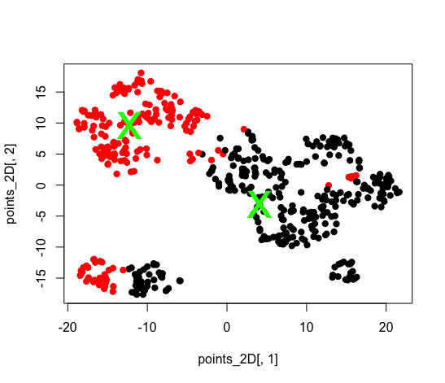
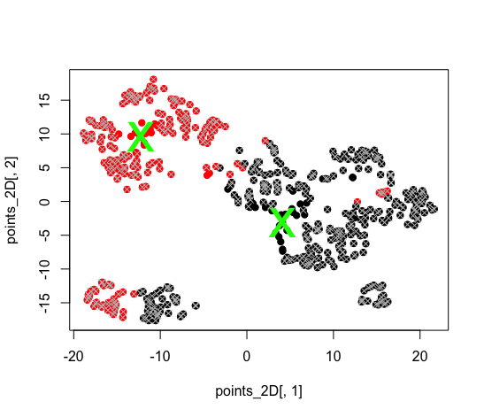

##Quick start
The spathial package contains function to create a path able to navigate a n-dimensional space. __ADD__ 

The sections below show the most basic steps which allows to compute the principal path. 

Intall spathial using

```r
install.packages("spathial")
```

to ensure that all the needed spackages are installed.


##Step 1: load data
To compute the principal path we assume that you have an input matrix ```X```. Each column of the matrix ```X``` is a feature and each row has a univocal name. We also assume that you have an input vector ```X_labels``` which contains for each row of ```X``` the corresponding label. For the sake of simplicity, we create a simple .csv file with 500 samples. The following code chunck shows how to load the .csv and how to format the data.

```r
#load the dataset
myfile<-system.file("extdata", "example.csv", package = "spathial")
data<-read.csv(myfile,as.is=TRUE,header=TRUE)

#matrix X with 4 columns (4 dimensions) and univocal rownames
X <- data[,2:(dim(data)[2]-1)]
rownames(X)<-paste0("sam",rownames(X))

#vector X_labels
X_labels <- data$Y
```

Computing the function ```head``` given ```X``` and ```X_labels``` as input you can obtain the following output:

```r
> head(X)
             X1         X2          X3         X4
sam1  0.6919111  1.0563105  0.80650023 -1.4920288
sam2  0.5680345  0.3875362  1.21112690 -0.6233043
sam3  0.6919111  0.8087083  0.80650023 -0.1369691
sam4  0.9868512 -1.0261369 -0.61835450 -0.3045696
sam5 -0.1521175  0.3175302  1.24326861 -1.3593687
sam6  0.3749487 -1.0261369 -0.02172219 -0.3905871

> head(X_labels)
[1] 1 1 1 2 1 2
```

To following code chunk shows how to plot the datapoints colored according to ```X_labels```:

```r
#Plot the results
set.seed(1)
tsne_res <- Rtsne::Rtsne(as.matrix(X), dims = 2, perplexity = 30)
points_2D <- tsne_res$Y
boundary_ids_2D <- points_2D[which(rownames(X) == boundary_ids[1] | rownames(X) == boundary_ids[2]),]

plot(points_2D[,1],points_2D[,2], col=X_labels, pch=19)
points(boundary_ids_2D[,1],boundary_ids_2D[,2], pch="x",col="green",cex=4)
```

The following picture shows the graphical representation of the datapoints:


##Step 2: select the boundaries
The fist step to compute the principal path consists in selecting the starting and the ending points. The package spathial gives you the function ```spathialBoundaryIds``` which takes as input the matrix ```X```, the corresponding labels ```X_labels``` and the parameters ```mode```, ```from``` and ```to```.

The parameter ```mode``` has to assume one the following values:

* __1__ _(default)_: the user can randomly choose the starting and the ending points directly from the 2D representations of the data points. In this case the values of the parameters ```from``` and ```to``` are not considered.
* __2__: the starting point is the centroid of all the data points labelled as the parameter ```from```, while the ending point is the centroid of all the data points labelled as the parameter ```to```.
* __3__: the starting point is the data point with the univocal rowname equal to the parameter ```from``` while the ending point is the data point with the univocal rowname equal to the parameter ```to```.

The output of the function ```spathialBoundaryIds``` is a list with the following content:

* __X__: the initial input matrix ```X``` plus the starting and the ending points;   
* __X_labels__: the initial vector ```X_labels``` inclusive of the labels of the starting and the ending points; 
* __boundary_ids__: the rowname of the starting and the ending points.

__Attention!!__ The matrix ```X``` and the vector ```X_labels``` change only when ```mode=2``` (the resulting matrix and vector have two additional elements, corresponding to the centroids).

The following code chuncks show how to use the function ```spathialBoundaryIds```, with different values of the parameter ```mode```, and how to extract the output:

```r
#mode=1
boundary_init <- spathialBoundaryIds(X, X_labels, mode=1)
```

```r
#mode=2
boundary_init <- spathialBoundaryIds(X, X_labels, mode=2, from=1, to=2)
```

```r
#mode=3
boundary_init <- spathialBoundaryIds(X, X_labels, mode=3, from="sam4", to="sam497")
```

```r
#take the output from the variable boundary_init
boundary_ids <- boundary_init$boundary_ids
X <- boundary_init$X
X_labels <- boundary_init$X_labels
```

```r
#Plot the results
set.seed(1)
tsne_res <- Rtsne::Rtsne(as.matrix(X), dims = 2, perplexity = 30)
points_2D <- tsne_res$Y
boundary_ids_2D <- points_2D[which(rownames(X) == boundary_ids[1] | rownames(X) == boundary_ids[2]),]

plot(points_2D[,1],points_2D[,2], col=X_labels, pch=19)
points(boundary_ids_2D[,1],boundary_ids_2D[,2], pch="x",col="green",cex=4)
```

The following picture shows the boundaries when ```mode=2```, ```from=1``` and ```to=2```:


##Step 3: prefiltering (optional)
The principal path is an algorithm intrinsically global. If you are searching for a path which does not involve the whole dataset, you can perform the function ```spathialPrefiltering```  before the principal path algorithm is applied, otherwise this filtering procedure is not due.

The function ```spathialPrefiltering``` takes as input the matrix ```X```, the corresponding labels ```X_labels``` and the boundaries ```boundary_ids``` which are the result of the function ```spathialBoundaryIds```.

The output of the function ```spathialPrefiltering``` is a list with the following content:

* __mask__: the indexes of the samples to preserve;   
* __boundary_ids_filtered__: the rowname of the starting and the ending points.

The following code chunck shows how to use the function ```spathialPrefiltering``` and how to extract the output:

```r
# Prefilter data
filter_res <- spathialPrefiltering(X, X_labels, boundary_ids)

mask <- filter_res$mask
boundary_ids <- filter_res$boundary_ids

#Plot the results
set.seed(1)
tsne_res <- Rtsne::Rtsne(as.matrix(X), dims = 2, perplexity = 30)
points_2D <- tsne_res$Y

boundary_ids_2D <- points_2D[which(rownames(X) == boundary_ids[1] | rownames(X) == boundary_ids[2]),]
X_garbage_2D <- points_2D[!mask,]

plot(points_2D[,1],points_2D[,2], col=X_labels, pch=19)
points(boundary_ids_2D[,1],boundary_ids_2D[,2], col="green", pch=20, cex=2)
points(X_garbage_2D[,1],X_garbage_2D[,2], col="gray", pch=4)
```

The following picture shows the result of the plot:


##Step 4: principal path

##Step 5: unserstanding the results

###Compute lables with Knn

###Plot 2D data with t-SNE

###Compute the correlation


